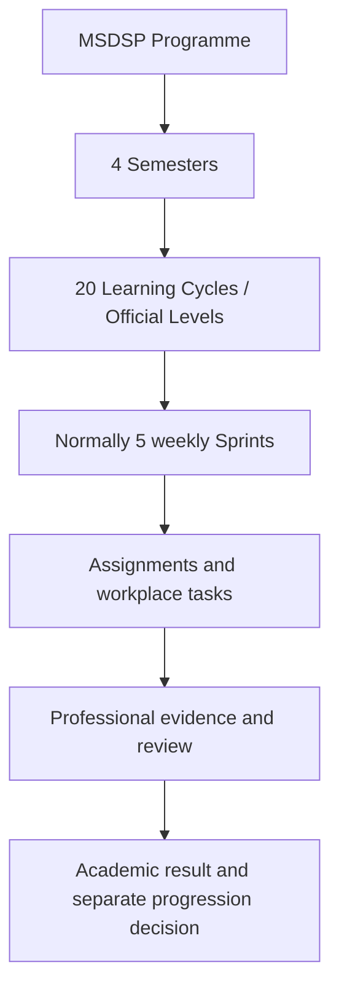

# MSDSP Applied Learning Portal

An interactive academic prototype for the proposed **M.Sc. Data Science and Product Development (MSDSP)** programme at the Centre for Digital Innovation and Product Development (CDIPD), Digital University Kerala.

The portal models a work-integrated postgraduate experience in which learners complete authentic product-development work, submit professional evidence, receive mentor feedback, and progress through governed Learning Cycles. It separates official academic evaluation from gamification and keeps attendance outside the portal.

## Live prototype

[Open the public MSDSP Applied Learning Portal](https://msdsp-portal-redesign.sridas-d791339.chatgpt.site)

The live site and this repository are prototypes. Authentication, uploads, persistence and external integrations are simulated.

## Programme model



Core rules represented in the prototype:

- One Learning Cycle maps to one official Level.
- Each semester contains five Levels.
- A Level normally contains five weekly Sprints.
- Courses carry credits; Levels organise delivery; Sprints organise work.
- Assignments map course units and outcomes to workplace artifacts.
- Mentors guide, review and recommend; authorised academic faculty approve marks.
- Academic results, gamification points and progression status remain separate.
- Attendance is managed exclusively in DUK@360.

## Workspaces

| Workspace | Primary purpose |
|---|---|
| Student | Work planning, professional evidence, feedback, competencies, calendar and results |
| Mentor | Allocations, learner support, Sprint guidance, evidence review, calibration, escalation and recommendations |
| Course Head | Programme governance, Course Details, coordination, Level planning, assignments, academic evaluation and reporting |

Mentors are represented as two operational personas:

- **Domain Mentor** — specialist quality and competency review.
- **Student-Team Mentor** — continuous team guidance, work coordination and referral.

## Current prototype scenario

- Primary learner: **Anakha Rajesh**
- Course Head: **Dr. Ajith Kumar**
- Active context: **Semester II · LC-09 · Official Level 9**
- Level focus: **Full Stack Integration & Testing**
- Representative cohort: Alfin, Anakha Rajesh, Annamma, Annrosna and Dhanush Girish
- Representative artifacts: OpenAPI specification, pull requests, database migrations, automated test reports, runbooks, demonstrations and retrospectives

## Technology

- Next.js 16 and React 19
- TypeScript
- Vinext/Vite for Cloudflare Workers-compatible builds
- Mermaid for workflow diagrams
- Drizzle scaffolding for future D1 persistence
- CSS design system with light, dark and system themes
- Browser `localStorage` for prototype theme and Learning Cycle preference

## Run locally

Requirements:

- Node.js `>=22.13.0`
- npm

```bash
npm ci
npm run dev
```

Validation:

```bash
npm run lint
npm run build
npm test
```

## Repository structure

```text
app/
  page.tsx                 Main interactive portal and workspace screens
  globals.css              Responsive design system, themes and animation
  coordination-data.ts     Proposed coordination and Level allocations
  layout.tsx               Metadata, fonts and theme bootstrap
db/                        Future Drizzle/D1 persistence layer
docs/                      Programme, workflow and implementation context
public/                    Public SVG assets
tests/                     Rendered prototype verification
worker/                    Cloudflare Worker entrypoint
.openai/hosting.json       Existing Sites project identity
```

## Documentation

- [Project context](docs/PROJECT_CONTEXT.md)
- [Course and Level model](docs/COURSE_AND_LEVEL_MODEL.md)
- [User roles and workflows](docs/USER_ROLES_AND_WORKFLOWS.md)
- [Gamification and assessment](docs/GAMIFICATION_AND_ASSESSMENT.md)
- [Course coordination plan](docs/COURSE_COORDINATION_PLAN.md)
- [System architecture](docs/SYSTEM_ARCHITECTURE.md)
- [Production preconditions](docs/PRODUCTION_PRECONDITIONS.md)
- [Programme rules decision register](docs/PROGRAMME_RULES_DECISION_REGISTER.md)
- [Prototype scope and limitations](docs/PROTOTYPE_SCOPE_AND_LIMITATIONS.md)

## Governance and privacy

The Course Coordination Plan is explicitly marked as a **proposal pending Programme Board approval**. Named learner and staff records are prototype data published with repository-owner authorization; they must not be treated as official academic records. Before production, replace prototype records with governed master data, access controls, audit trails and approved privacy/retention rules.
