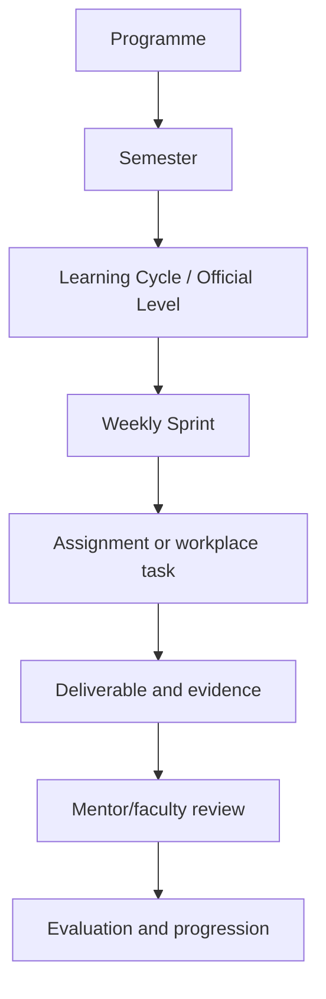
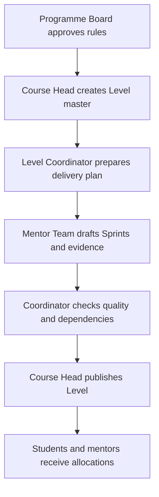
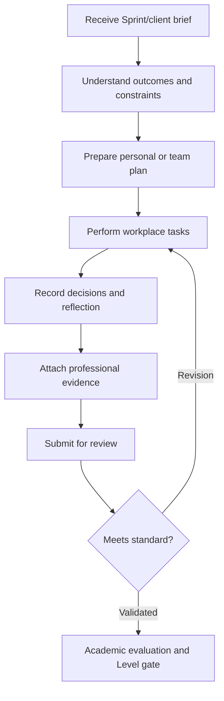

# Course and Level Model

## Structural principle

**Courses carry credits. Learning Cycles/Levels organise delivery. Sprints organise work.**



The programme contains four semesters and 20 official Levels, normally five Levels per semester. Each Level normally contains five weekly Sprints; semester-ending Levels may require a longer review window.

## Academic and delivery relationships

Courses and course units may span several Levels. They should be related through mappings rather than rigidly nested under a single Level.

```text
Learning Cycle ↔ Course
Learning Cycle ↔ Course Unit
Assignment ↔ Course assessment component
Assignment ↔ PO/PSO
Evidence ↔ Assignment and Task
Review ↔ Evidence and Faculty/Mentor
Academic Evaluation ↔ Reviewed evidence
Progression Decision ↔ Learning Cycle result
```

## Semester journey

| Semester | Prototype focus | Expected evolution |
|---|---|---|
| I | Research, UX, frontend and architecture blueprint | Validate the problem and define the product direction |
| II | Backend, data, APIs, full-stack integration and testing | Produce a functional locally deployed solution |
| III | Microservices, cloud, MLOps, security and hardening | Integrate, deploy and strengthen the product |
| IV | Final product, industry placement, evaluation and viva | Deliver and defend an industry-oriented final product |

The supplied programme explorer represents each semester as 20 credits and describes an overall practical-first balance. Credit totals remain subject to the source inconsistencies documented in the decision register.

## Level creation and publication



### Ownership

| Activity | Accountable role |
|---|---|
| Maintain programme/course masters | Course Head / authorised academic administration |
| Create Learning Cycle/Level | Course Head |
| Prepare Level delivery plan | Level Coordinator |
| Draft Sprint tasks and evidence expectations | Level Coordinator with Mentor Team |
| Publish official dates and Level content | Course Head |
| Create personal work plan | Student or team |
| Review assigned evidence | Mentor and authorised faculty |
| Publish academic result and progression | Course Head / authorised academic faculty |

## Example: Level 1

The coordination workbook assigns Level 1, **Orientation & Foundations**, to Vyga V R, with Soorya Krishnan G supporting Sprint cadence and Smitha Surendran supporting onboarding/student success.

| Sprint | Focus | Representative artifact |
|---|---|---|
| 1 — Orient | Programme, workplace and professional expectations | Professional development plan |
| 2 — Discover | Problem, stakeholder and user context | Stakeholder map and problem statement |
| 3 — Form | Team roles and ways of working | Team charter and communication protocol |
| 4 — Collaborate | Git-based professional delivery | Repository, commits and pull request |
| 5 — Demonstrate | Foundation review and reflection | Demonstration and Sprint retrospective |

Representative candidate allocation: Alfin, Anakha Rajesh, Annamma, Annrosna and Dhanush Girish.

## Student delivery flow



## Credit boundary

A Level completion does not independently award course credit. Credit is awarded only through the approved course structure after evidence is evaluated against the applicable academic components and authorised results are published.

