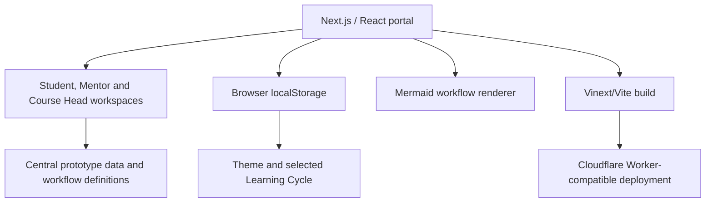
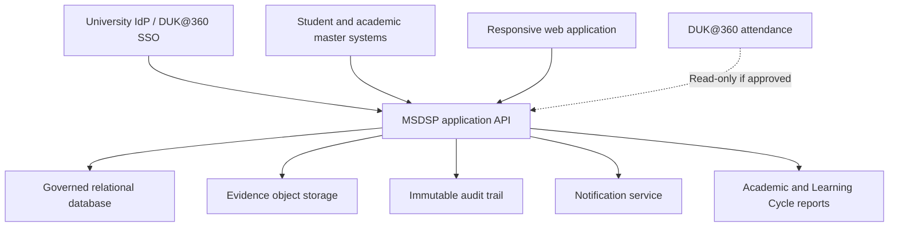

# System Architecture

## Current prototype architecture

The current application is a single interactive Next.js/Vinext portal driven by central TypeScript mock data and client-side state.



## Current components

| Component | Current implementation |
|---|---|
| UI | React client components in `app/page.tsx` |
| Styling | Semantic CSS tokens, responsive layouts and motion in `app/globals.css` |
| Coordination data | `app/coordination-data.ts` |
| Programme/workflow data | Central constants in `app/page.tsx` |
| Persistence | Theme and selected cycle only, through `localStorage` |
| Authentication | Simulated role/persona switching |
| File evidence | Simulated dialog and filenames |
| Database | Drizzle/D1 scaffolding; no production schema in use |
| Hosting | Sites project deployed through a Cloudflare Worker-compatible build |
| Tests | Rendered HTML assertions and production build validation |

## Current state model

The root client component owns:

- Active role: Student, Course Head or Mentor
- Mentor type: Domain or Student-Team
- Active page
- Active Learning Cycle
- Theme
- Navigation/dialog/toast presentation state

This is appropriate for a design prototype but should be decomposed before production.

## Target production architecture



## Recommended service boundaries

| Service/domain | Responsibility |
|---|---|
| Identity and access | SSO, role claims, enrolment and permission checks |
| Programme master | Programme, year, semester, course, unit, Level and Sprint definitions |
| Allocation | Student/team/faculty/mentor assignments and capacity |
| Assignment | Client briefs, tasks, milestones, outcomes and evidence requirements |
| Evidence | Upload, versioning, retention, scanning and locking |
| Review | Criterion judgements, feedback, revision and resubmission |
| Academic evaluation | Approved components, weighted contributions and publication |
| Gamification | XP/mastery, verified badges and configurable Level Gate |
| Certification | Expected certification, status, evidence and verification |
| Recovery | Remediation plan, retry, support and closure |
| Audit/reporting | Actor/action history, decision traceability and reports |

## Minimum production entities

```text
Programme, AcademicYear, Semester, LearningCycle, Sprint,
Course, CourseUnit, ProgrammeOutcome, ProgrammeSpecificOutcome,
User, Student, Faculty, MentorAssignment, Team,
Assignment, Task, Milestone, Deliverable, Evidence, EvidenceVersion,
Review, Rubric, RubricCriterion, AcademicEvaluation,
GamificationResult, Badge, Certification, RecoveryPlan,
ProgressionDecision, Notification, AuditEvent
```

## Non-functional requirements

- Role-based access checked on the server.
- Auditability for every academic and allocation decision.
- Evidence integrity, malware scanning, versioning and retention.
- Accessible keyboard/touch interaction and meaningful status language.
- Responsive support for desktop and mobile.
- Light, dark and system themes with reduced-motion support.
- Configurable calculations rather than hard-coded governance rules.
- Clear failure states for unavailable integrations.
- No inference of attendance or performance from time spent online.

## Migration approach

1. Extract domain types and mock records from visual components.
2. Introduce route-level workspace layouts and URL-based context.
3. Replace simulated identity with an authentication provider interface.
4. Implement programme and allocation masters.
5. Add evidence, review and audit persistence.
6. Add academic evaluation after Programme Board approval.
7. Add gamification and recovery as separately configurable services.
8. Integrate external systems only after contracts and owners are confirmed.

