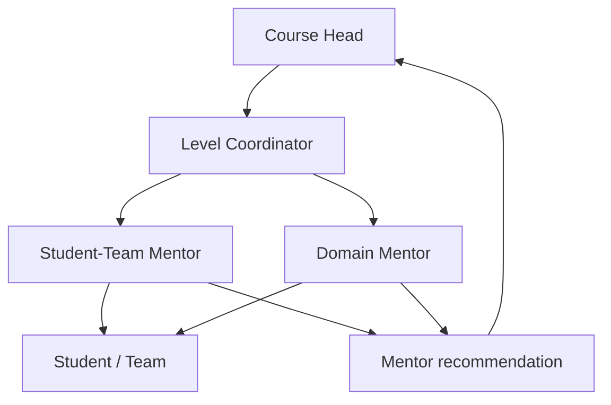
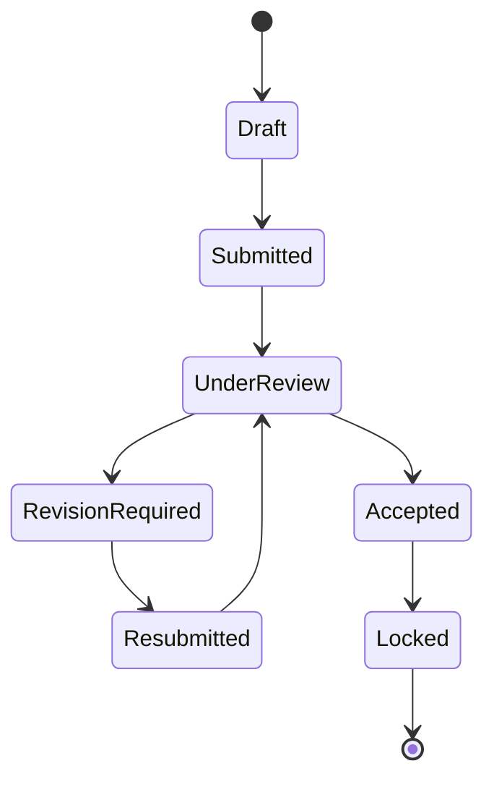

# User Roles and Workflows

## Authority model

The prototype separates academic authority from mentoring support.

Mentors can create guidance, document reviews, request revisions and submit recommendations. Official academic marks, deadlines, course credits and progression decisions remain with authorised academic roles.

## Course Head

### Lifecycle

1. Configure programme and course masters.
2. Create and contextualise the Learning Cycle/Level.
3. appoint the Level Coordinator and Mentor Team.
4. Review Sprint structure, evidence requirements and dependencies.
5. Publish official Level content and deadlines.
6. Monitor aggregate delivery and evidence quality.
7. Authorise academic evaluation and progression decisions.
8. Publish reports and close the Level.

### Portal pages

- Overview
- Course Details
- Programme Workflow
- Course Coordination
- Learning Cycle Planning
- Assignment Management
- Student Monitor
- Activity Review
- Academic Evaluation
- Reports & Analytics

## Level Coordinator

The Level Coordinator is an operational responsibility within the Faculty/Course Head governance model, not a separate prototype login.

Responsibilities:

- Convert the approved Level intent into a delivery plan.
- Coordinate Sprints, mentors, learner/team allocation and dependencies.
- Check briefs and evidence expectations before publication.
- Monitor unresolved risks and mentor capacity.
- Consolidate mentor recommendations for the Course Head.
- Escalate academic exceptions without making unilateral academic decisions.

## Student-Team Mentor

### Purpose

Provide continuous professional guidance to an assigned cohort or team and connect day-to-day delivery to academic evidence requirements.

### Lifecycle

1. Accept a formal Level/team allocation.
2. Review the approved brief, rubric and evidence expectations.
3. Establish team roles, communication and Sprint working agreements.
4. Facilitate checkpoints and remove delivery blockers.
5. Inspect artifacts such as tickets, pull requests, runbooks and retrospectives.
6. Record evidence-linked feedback and rework actions.
7. Refer specialist artifacts to Domain Mentors where necessary.
8. Consolidate learner/team progress and unresolved risks.
9. Submit a recommendation to the Level Coordinator/Course Head.
10. Verify closure and archive the mentoring record.

### Important gaps to control

- No implied access to learners outside the formal allocation.
- No attendance inference from login or activity data.
- No unilateral official deadline changes.
- No publication of academic marks or progression.
- Every action requires actor, timestamp, scope and evidence reference.
- Workload/capacity must be visible to avoid overlapping review commitments.

## Domain Mentor

### Purpose

Apply a specialist professional standard to referred evidence, calibrate judgement across teams and recommend competency status.

### Lifecycle

1. Accept an assignment or specialist referral.
2. Review the competency, rubric and anchor examples.
3. Calibrate with the Level Coordinator and other reviewers.
4. Inspect the technical artifact and its reproducibility.
5. Record criterion-level findings.
6. Request evidence-linked revision when required.
7. Re-review the resubmission.
8. Validate or decline the competency claim.
9. Submit the specialist recommendation.
10. Support closure or escalation.

## Student

### Lifecycle

1. Open the current Learning Cycle and Sprint context.
2. Understand the client brief, outcomes, constraints and rubric.
3. Create a personal/team work plan within official deadlines.
4. Perform the workplace task.
5. Record decisions, blockers, learning and reflection.
6. Attach authentic professional artifacts.
7. Submit evidence for review.
8. Respond to feedback through revision/resubmission.
9. Demonstrate and defend the work.
10. View academic results separately from gamification and progression.

### Portal pages

- Overview
- Work Board
- Evidence & Portfolio
- Skills & Outcomes
- Faculty Feedback
- Calendar
- Performance & Results
- Information Centre

Course Details are intentionally not shown in the Student workspace. Student-facing programme guidance, FAQs and abbreviations are consolidated in Information Centre.

## Evidence review states

Recommended record fields: artifact version, student/team, assignment, Sprint, reviewer, submission timestamp, criterion findings, revision request, acknowledgement, final status and audit history.

